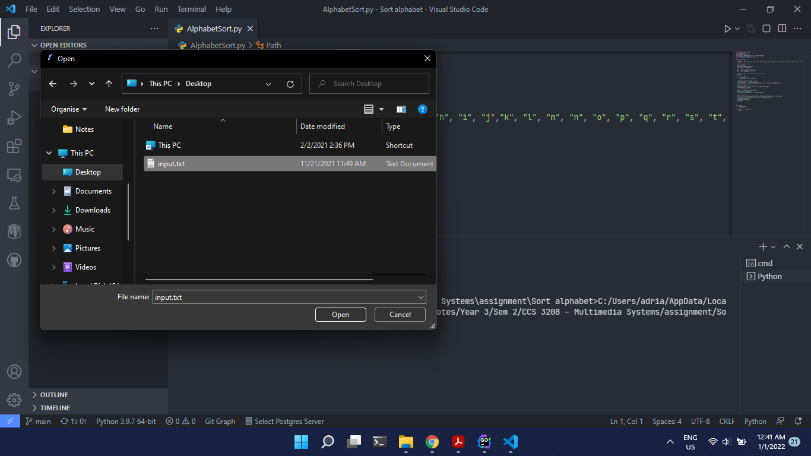
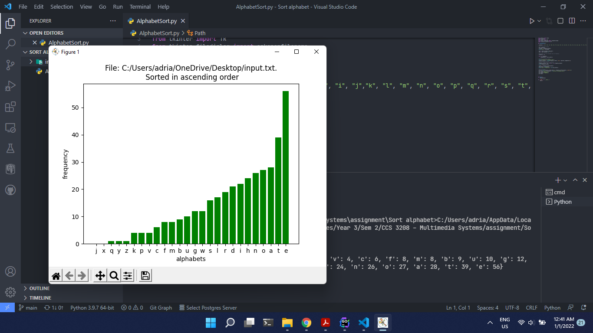

# Sort-alphabet
A simple python program that takes an input text file and sorts the alphabets present in ascending order and displays it in a graph

## Libraries
<ol>
  <li>Pathlib</li>
  <ol>
      <li>Path</li>
    </ol>
  <li>Operator</li>
  <li>Tkinter</li>
  <ol>
      <li>filedialog</li>
    <ol>
      <li>askopenfilename</li>
    </ol>
    </ol>
  <li>Mathplotlib.pyplot</li>
</ol>

## When you run

